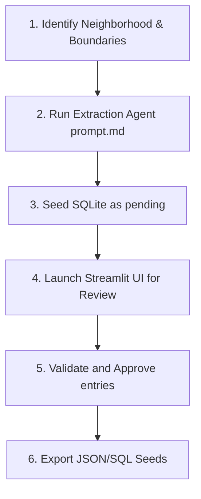

# Agent Guidelines: Exploring New Neighborhoods

This document provides step-by-step instructions for subsequent AI agents or automated pipelines to extend the **Neighborhood Explorer** module to new areas beyond "Sevilla Este".

---

## The Neighborhood Exploration Pipeline
To collect and import high-quality restaurant data for a new neighborhood, follow this standard process:



---

## Step 1: Boundary Identification & Naming
Before starting extraction, determine the name and approximate coordinates of the neighborhood.
1.  **Define Neighborhood Name**: Choose the official neighborhood name (e.g., `'Triana'` or `'Los Remedios'`).
2.  **Determine Coordinates**: Search for the neighborhood's bounding box coordinates (min/max latitude and longitude).
    *   *Example (Triana)*: Latitude `37.378` to `37.392`, Longitude `-6.015` to `-5.998`.

---

## Step 2: Extract & Seed Candidates
Using the instructions in `prompt.md`:
1.  Provide the AI extraction agent with the name of the new neighborhood and its coordinates.
2.  Have the agent extract 10-20 popular restaurant listings. Make sure they extract names, descriptions, cuisines, price levels, exact coordinates, addresses, and cover photo URLs.
3.  Instruct the agent to generate a seeding script (e.g., `seed_new_neighborhood.py`) using the template in `prompt.md`.
4.  Run the seeding script to insert the records into `data/explorer.db` with `'pending'` status and the appropriate `'neighborhood'` text.
    ```bash
    python seed_new_neighborhood.py
    ```

---

## Step 3: Run the Verification UI
1.  Start the Streamlit application:
    ```bash
    streamlit run src/app.py
    ```
2.  In the left sidebar, change the **Active Neighborhood** dropdown to select the new neighborhood.
3.  Go through the **Pending Candidates** tab:
    *   Verify coordinates on the interactive map.
    *   Confirm the name, cuisine type, description, and photo URL are correct.
    *   Approve the entries to mark them `'valid'`, or reject them to mark them `'invalid'`.

---

## Step 4: Export Validated Entries
Once validation is complete:
*   Use the **Approved Restaurants** tab to export the validated entries for that neighborhood.
*   Or run the CLI tool:
    ```bash
    python src/export.py --format both
    ```
*   Apply the generated JSON or SQL seed script to the main application's database.
